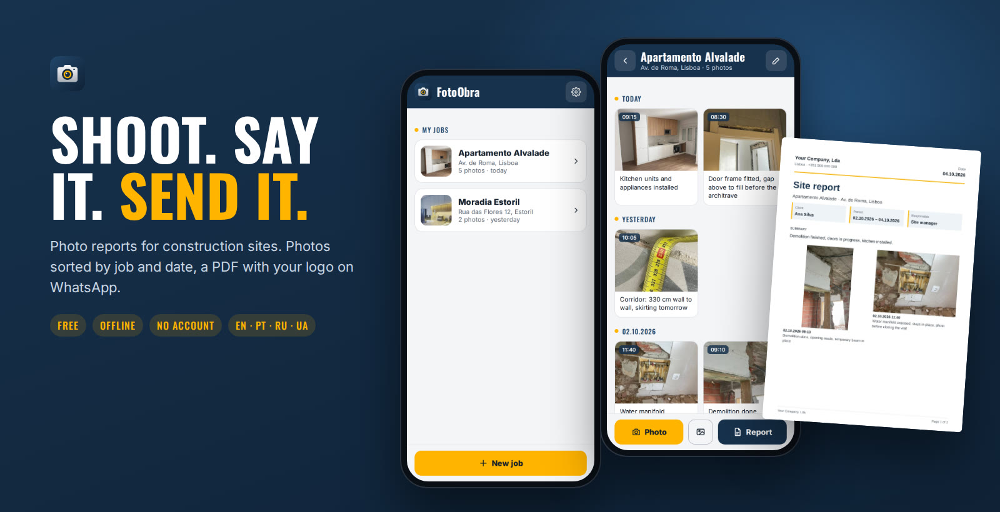
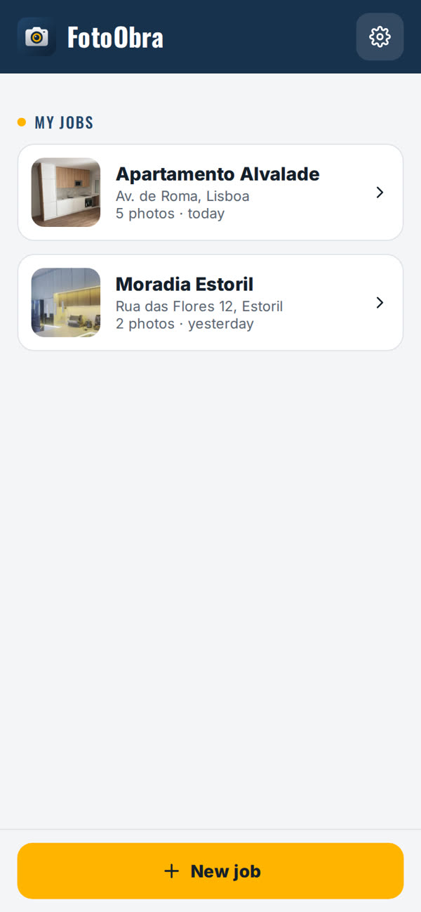
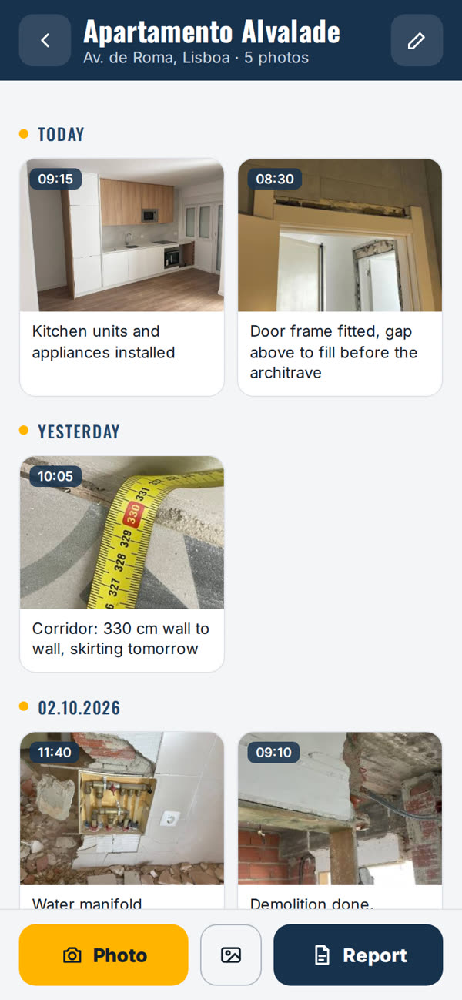
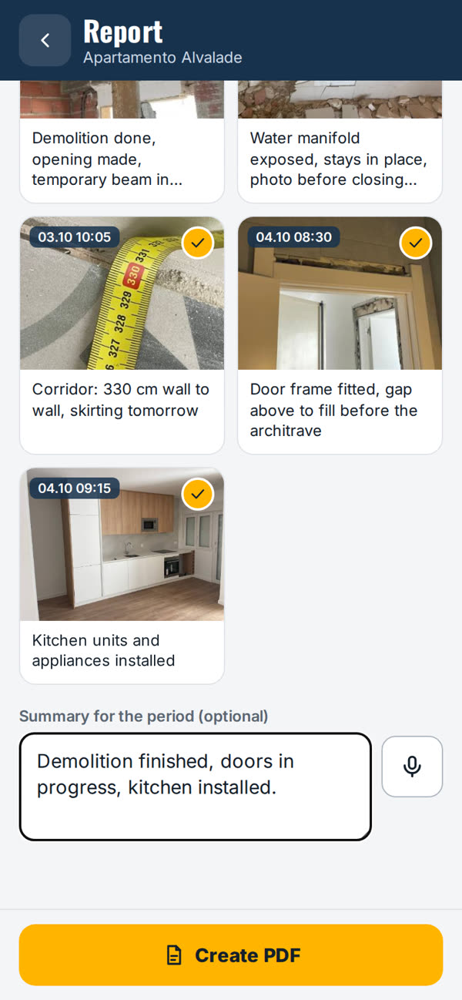
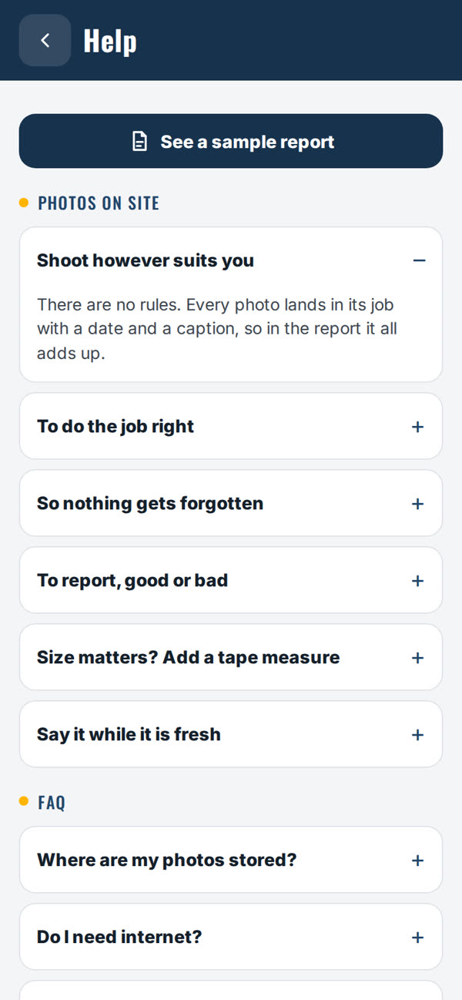
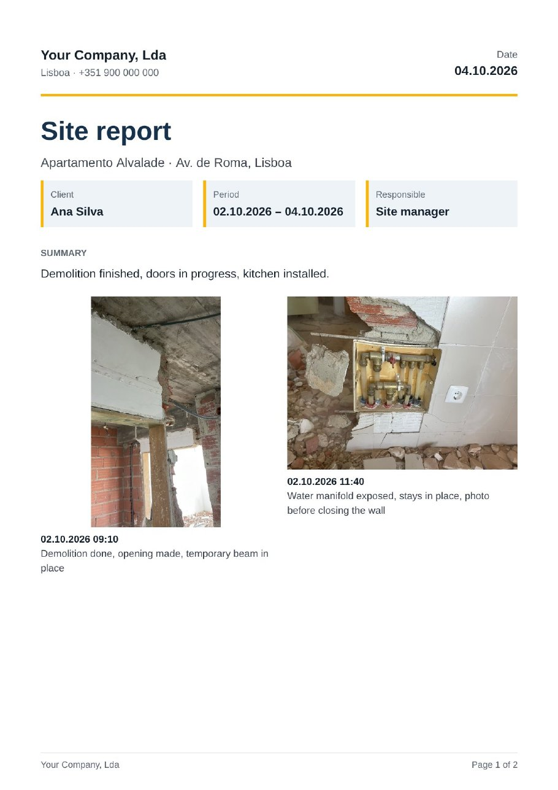
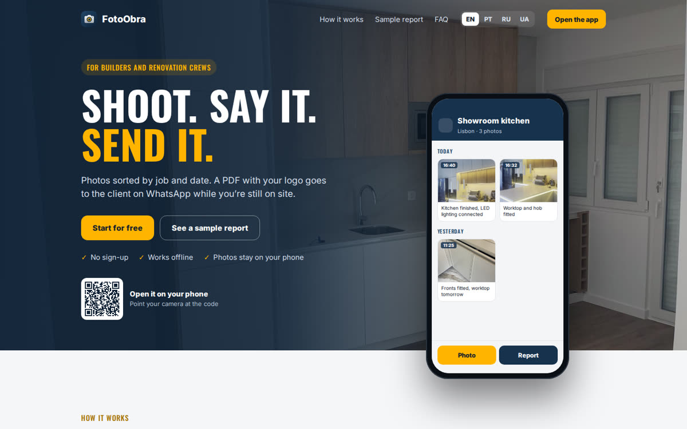

# FotoObra

**Shoot. Say it. Send it.** Photo reports for construction sites.

Photos sorted by job and date. A PDF with your logo goes to the client on WhatsApp while you're still on site. Free, works offline, no account.

**[Website](https://davydmedvedchuk.github.io/fotoobra/)** · **[Open the app →](https://davydmedvedchuk.github.io/fotoobra/app/)** · **[Sample report (PDF)](https://davydmedvedchuk.github.io/fotoobra/assets/sample-report-en.pdf)**

## Why

A building site produces dozens of photos a day: before, during, after. They get mixed with personal photos in the gallery, and the report for the client is put together by hand in the evening.

FotoObra keeps photos by job and turns them into a clean PDF in a couple of taps.

## What it does

- **Jobs.** Name, address, client.
- **Photos by day.** Straight from the camera or several at once from the gallery.
- **Voice captions.** Tap the mic and say what was done.
- **PDF report.** Today, last 7 days, all, or custom dates. Tap a photo to leave it out. Your logo and company name in the header. Portrait photos keep their shape.
- **Send.** Share the PDF straight to WhatsApp, e-mail or Drive.
- **Backup.** One file with everything. Restore on a new phone.
- **Four languages.** App, website and reports in English, Portuguese, Russian and Ukrainian. English by default.
- **Help inside.** A sample report, why photos on site matter, and FAQ.

| Jobs | Photo feed | Report | Help |
|---|---|---|---|
|  |  |  |  |

### The PDF your client gets

### The website

## How it works

Two HTML files: the website (`index.html`) and the app (`app/index.html`). No framework, no backend, no external libraries.

- **Storage:** IndexedDB. Photos never leave the phone.
- **Photos:** resized on device to 1600 px, plus a small thumbnail for the feed.
- **Voice:** the browser's built-in Web Speech API.
- **PDF:** each page is drawn on a canvas and packed into a PDF by a ~40-line writer. That keeps Cyrillic text working without embedding fonts.
- **Fonts:** Oswald and Inter, self-hosted in `assets/fonts`.
- **Offline:** a service worker caches the app after the first visit.
- **Hosting:** GitHub Pages. Free.

## Install on your phone

1. Open the app link above.
2. **iPhone:** Safari → Share → Add to Home Screen.
   **Android:** Chrome → ⋮ → Add to Home screen.
3. Always open it from the icon.

## Good to know

- Data lives only on the phone that took the photos. Make a backup from Settings once a week.
- Voice captions work best in Chrome on Android. On iPhone you can use the mic on the keyboard.

## Next

- [ ] Draw on photos (arrows, circles)
- [ ] Before / after pairs
- [ ] Share a report as a link

## License

[MIT](LICENSE). Fonts: Oswald and Inter, SIL Open Font License.
